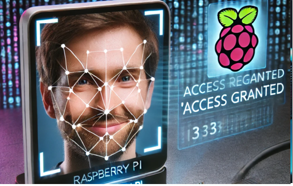
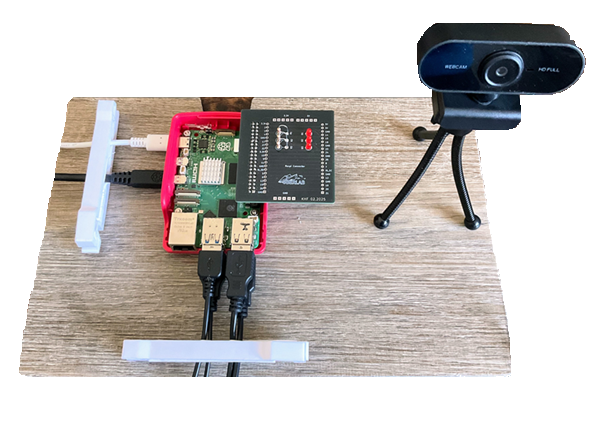
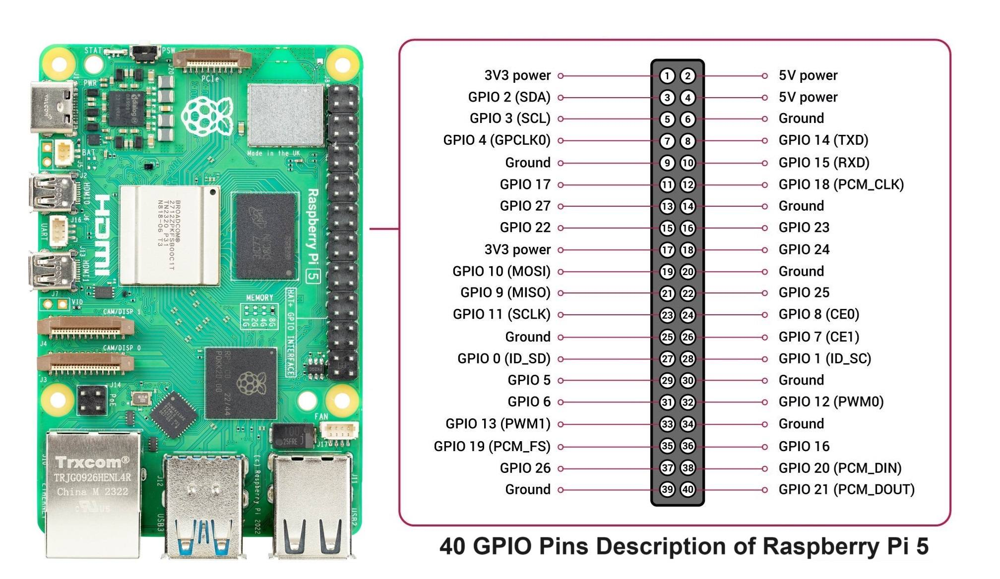
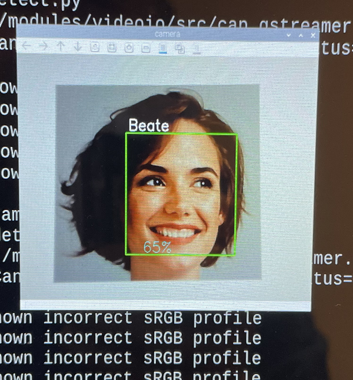
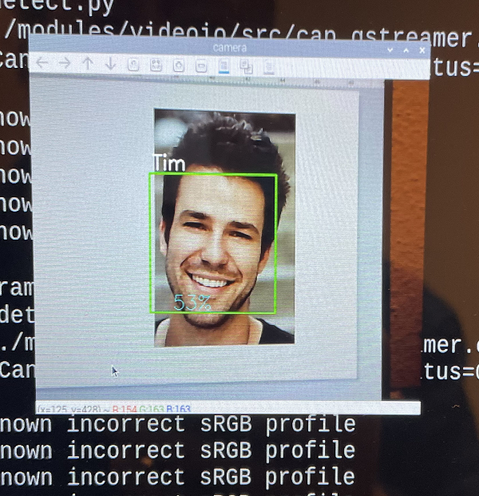

<a name="oben"></a>

<div align="center">

# Zugangskontrolle - Personen erkennen und GPIOs steuern


|[:skull:ISSUE](https://github.com/KI4kids/03_KI4Kids_Access/issues?q=is%3Aissue)|[:speech_balloon: Forum /Discussion](https://github.com/KI4kids/03_KI4Kids_Access/discussions)|[:grey_question:WiKi](https://github.com/KI4kids/03_KI4Kids_Access/blob/main/wiki.md)|
|--|--|--|
| | | | 
| <a href="https://github.com/KI4kids/03_KI4Kids_Access/pulse" alt="Activity">| <a href="https://github.com/KI4kids/03_KI4Kids_Access/graphs/traffic">  |<a href="https://github.com/frankyhub?tab=stars"> |





</div>


## Story
Künstliche Intelligenz (KI) bezeichnet die Fähigkeit von Maschinen, menschenähnliche Intelligenzleistungen zu erbringen. Das umfasst das Lernen aus Erfahrungen, das Verstehen von Sprache, das Treffen von Entscheidungen und das Lösen komplexer Probleme. Im Wesentlichen geht es darum, Computer so zu programmieren, dass sie Aufgaben erledigen können, die normalerweise menschliche Intelligenz erfordern.

Dieses Repo beschreibt eine Zutrittskontrolle mit Gesichtserkennung. Die KI-Zutrittskontrolle ist ein Teil des Fablab Oberland Bildungsprogramms. Ziel ist es, mithilfe der KI-Plattform OpenCV Gesichter zu erkennen und basierend auf diesen Informationen einen GPIO oder einen Servo-Motor zu steuern.

• Die Kamera erkennt ein Gesicht

• OpenCV überprüft, ob die Person autorisiert ist

• Bei Erkennung öffnet sich der Türschließer für 2 Sekunden

---

GPIOs mit Python steuern und eine Zugangskontrolle mit Gesichtserkennung realisieren



## Ablauf

- Inbetriebnahme des Raspberry Pi
- Virtual Environments mit Anaconda  
- Aufgaben der KI Modelle  
- Installation der KI Modelle
- GPIO Pakete installieren
- GPIO testen
- KI Pakete installieren (kein Anaconda)
- Bilder für die Zutrittskontrolle erstellen
- KI trainieren
- Gesichtserkennung testen
- Programm für die Zutrittskontrolle erstellen
- Programmtest -und Optimierung

## Linux Standard Base - Versionsabfrage
bash

```
lsb_release -a
```

| | |
|--|--|
|Distributor ID: | Debian|
|Description:|Debian GNU/Linux 12 (bookworm)|
|Relaese:|12|
|Codename:|bookworm|
| | |

---

## Anaconda 

Anaconda ist eine Python-Distribution für Datenverarbeitung von großen Mengen, vorhersagende Analyse und wissenschaftliche Berechnungen. Bestandteile des Anaconda Pakets sind NumPy, SciPy, matplotlib, pandas, IPython, Jupyter Notebook, scikit-learn und der Bibliothek Intel MKL.

### Versions-Kontrolle: https://repo.anaconda.com/archive/


### Anaconda installieren

bash
```sh
wget https://repo.anaconda.com/archive/Anaconda3-2025.06-0-Linux-aarch64.sh
```

cd tmp

bash
```sh
sh Anaconda3-2025.06-0-Linux-aarch64.sh
```

- press ENTER to continue
- q (Lizenzvereinbarungen mit q Abbrechen)
- yes (Installation in /home/khf/anaconda3)
- enter (Installing base environment)
- yes (running conda)


```diff

! *** Die Shell neu starten *** !

```


Ist Anaconda korrekt installiert?

bash

```
conda --version

```

Kontrolle:

conda 25.5.1

(base) khf@pi:~/temp $

---

### Python kontrollieren:

bash

```
python --version 
```
Python 3.13.5 

---
## Virtual Environments in Anaconda (Virtuelle Umgebungen) 

In der Softwareentwicklung, besonders in Python, gibt es den Begriff der virtuellen Umgebung oder virtual environment. Das ist eine isolierte Umgebung, in der du Software-Bibliotheken installieren kannst, ohne die globale Installation von Bibliotheken auf deinem System zu verändern. Dies ist besonders nützlich, um Versionskonflikte zwischen verschiedenen Projekten zu vermeiden.

### Das Environment access installieren

bash


```
conda create -n access
```

```
conda activate access
```

```
conda env list
```

### So könnte man das Environment access wieder löschen

```
conda remove -n access --all
```
---
---
## Modelle und Datensätze

### Modelle
- yolo von Ultralytics
- OpenCV von Intel
- Pytorch  wurde von Meta AI (ehemals Facebook AI Research Lab) entwickelt seit 2017 Open source
- keras von google, jetzt Open source 
- TensorFlow von google

### Datensätze
- coco von Ultralytics
- kaggle von google 
- aws von Amazon web Service
- Open X-Embodiment Dataset und 
- Open-Physical-Interaction Dataset Collection von NVIDIA


### OpenCV 

OpenCV (Open Source Computer Vision Library) wurde ursprünglich von Intel im Jahr 1999 initiiert und ist seitdem zu einer der beliebtesten Bibliotheken für Computer Vision geworden. 
Die Bibliothek wurde entwickelt, um Forschern und Entwicklern eine einfache und effiziente Möglichkeit zu bieten, Computer Vision in Echtzeitanwendungen zu integrieren.
So wurde OpenCV ein beliebtes und umfassende Model für Computervisionsaufgaben und bietet eine Vielzahl von Tools und Algorithmen für die Bild- und Videoverarbeitung, Objekterkennung und Gesichtserkennung.


pip Installer

pip install ist ein Befehl, der im Python-Paketmanager pip verwendet wird, um Python-Pakete aus dem Python Package Index (PyPI) oder anderen Quellen zu installieren. Im Wesentlichen ermöglicht er die Installation, Aktualisierung und Verwaltung von Python-Softwarepaketen.


```
conda install anaconda::pip

```
OpenCV Standardpaket installieren

```
pip install opencv-python
```

Zusätzliche OpenCV Funktionen installieren

```
pip install opencv-contrib-python
```

Pillow Bibliothek installieren

```
pip install pillow
```
--- 

### USB-Kamera testen

Der Code erfasst den Videostream, der von der Kamera generiert wird, und zeigt sowohl im BGR-Farb- als auch im Graumodus an. Mit q wird er beendet.

```
cd
```
```
mkdir camtest
```
```
cd camtest
```


```
# camtest.py
# Video mit der USB-Kamera

import numpy as np
import cv2

cap = cv2.VideoCapture(0)

while(True):
    # Bild für Bild erfassen
    ret, frame = cap.read()

    # Die Bilder im Frame
    gray = cv2.cvtColor(frame, cv2.COLOR_BGR2GRAY)
   
    # Zeige den Frame an
    cv2.imshow('frame',frame)  #In Farbe
    #cv2.imshow('gray',gray)    #In SW

    if cv2.waitKey(20) & 0xFF == ord('q'):
        break

# Programm beenden
cap.release()
cv2.destroyAllWindows()

```

```
python camtest.py
```

---
---


### RASPI-GPIO

Bevor wir die Zutrittskontrolle realisieren und GPIOs beschalten, sehen wir uns zunächst einige Grundlagen an.

Der Raspberry Pi ist ein leistungsfähiger Mini-Computer. Dieser Mini-Computer ermöglicht den Erstkontakt zu Linux, Shell Scripting, Programmieren, Physical Computing und kann auch im Produktiveinsatz verwendet werden. Ganz nebenbei kann man mit dem Raspberry Pi viel über die grundsätzliche Funktionsweise von Computern lernen.

General Purpose Input Output, kurz GPIO, bezeichnet programmierbare Ein- und Ausgänge, die man für unterschiedliche Zwecke nutzen kann. GPIOs werden auf Platinen als Lötpunkte oder Pins in Form einer Stiftleiste herausgeführt und dienen als Schnittstelle zu anderen Systemen, Schaltungen oder Bauteilen, um diese über einen Raspberry Pi zu steuern. Dabei kann der Raspberry Pi bei entsprechender Programmierung digitale Signale von außen annehmen (Input) oder Signale nach außen abgeben (Output).
Viele der GPIOs erfüllen je nach Einstellung und Programmierung unterschiedliche Funktionen. Neben den typischen GPIO-Ein- und Ausgängen finden sich aber auch Pins mit der Doppelfunktion für I2C, SPI und eine serielle Schnittstelle.

Die GPIOs sind oftmals nur als Lötpunkte oder, beim Raspberry Pi vom Modell abhängig, als zweireihige Stiftleiste herausgeführt. Je nach Modell weist ein Raspberry Pi eine Stiftleiste mit 26 oder 40 Pins auf, wovon allerdings nicht alle zur Ein- oder Ausgabe dienen. Einige Pins führen ein festgelegtes +5V-, +3,3V- oder 0V-Potential


### Grundlagen GPIO

- Versorgungsspannung RASPI: 5V
- Spannung an den GPIOs: **3,3V**
- Maximalstrom der GPIOs: 15mA
- Maximalstrom 1 GPIO: **8mA**
- Funktion der GPIOS: Ein/Ausgänge
- Funktion der GPIOS: SDA/SCL (I²C BUS, SDA = Serial Data, SCL = Serial Clock)
- Funktion der GPIOS: MISO, MOSI, SCLK (Master Input/Slave Output, Master Output/Slave Input, SCLK Clock)
- Funktion der GPIOS: PWM (Pulsweitenmodulation)
- Funktion der GPIOS: TXT, RXT (TX – Transmit, RX – Receive)
- Funktion der GPIOS: CE0, CE1, ID_SC (CE Chip Enable, Chip Select))
- Funktion der GPIOS: PCM_DIN, PCM_DOUT (unkomprimiertes digitales Audio-Signal)




---

### RPi.GPIO und gpiozero

Die Python-Bibliotheken RPi.GPIO und gpiozero machen die Steuerung von Hardware-Komponenten durch GPIOs besonders einfach. 

### In der Regel sind die Python-Bibliotheken RPi.GPIO und gpiozero standardmäßig installiert.
Wenn die Bibliothek noch nicht installiert ist, sind folgende Kommandos auszuführen.

### RPi.GPIO Installation


```
sudo apt-get update
sudo apt-get install python-rpi.gpio
```


###  RPi.GPIO Beispiel in Thonny ausführen
```
# GPIO-Bibliothek laden
import RPi.GPIO as GPIO

# BCM-Nummerierung verwenden
GPIO.setmode(GPIO.BCM)

# time für die Wartezeit laden
from time import sleep

# GPIO 17 (Pin 11) als Ausgang setzen
GPIO.setup(17, GPIO.OUT)

# GPIO 17 (Pin 11) auf HIGH setzen
GPIO.output(17, True)
#GPIO.output(17, GPIO.HIGH)
#GPIO.output(17, 1)

# 1 Sekunde warten
sleep(1)

# GPIO 27 (Pin 13) auf HIGH setzen
GPIO.setup(27, GPIO.OUT)
GPIO.output(27, True)

# 1 Sekunde warten
sleep(1)

# GPIO 22 (Pin 15) auf HIGH setzen
GPIO.setup(22, GPIO.OUT)
GPIO.output(22, True)

# 1 Sekunde warten
sleep(1)

# Benutzte GPIOs freigeben und ausschalten
GPIO.cleanup()
```

### gpiozero Installation

```
sudo apt install python3-gpiozero
```

### Für häufig benötigte Hardware-Komponenten gibt es eigene gpiozero-Klassen. Dazu zählen unter anderem:

- LED (Leuchtdiode ein-/ausschalten)
  
- PWMLED (Helligkeit einer Leuchtdiode mit Software Pulse Width Modulation steuern)
  
- RGBLED (dreifarbige LED, die über drei GPIO-Ausgänge gesteuert wird)
  
- TrafficLights (Kombination aus einer roten, gelben und grünen Leuchtdiode)
  
- MotionSensor (für PIR-Bewegungssensoren)
  
- LightSensor (Lichtdetektor)
  
- Button (Taster)
  
- Buzzer (Summer)
  
- Motor (zur Steuerung von zwei GPIOs für Vorwärts- und Rückwärts-Signale)
  
- Robot (zur Steuerung mehrerer Motoren)
  
- MCP3008 (für den gleichnamigen A/D-Converter)


[Link gpiozero Dokumentation](https://gpiozero.readthedocs.io/en/stable/recipes.html#module-gpiozero)

[Link Pinout](https://gpiozero.readthedocs.io/en/stable/cli_pinout.html)

[Link Pintest](https://gpiozero.readthedocs.io/en/stable/cli_pintest.html)


### gpiozero-Test in Thonny ausführen

```
# LED 17 ein und nach 1 Sek aus
# Bibliotheken laden
from gpiozero import LED
from time import sleep

# Initialisierung von GPIO17 als LED (Ausgang)
led = LED(17)

# LED einschalten
led.on()

# 1 Sekunde warten
sleep(1)

# LED ausschalten
led.off()
```

### Das Blinken soll nur 10 mal ausgeführt werden

```
# Blink 10 mal
from gpiozero import LED
from time import sleep

# Initialisierung von GPIO17 als LED (Ausgang)
led = LED(17)

# Schleife genau 10 Mal ausführen
for i in range(10):
    led.on()      # LED einschalten
    sleep(0.1)    # 0,1 Sekunden warten
    led.off()     # LED ausschalten
    sleep(0.1)    # 0,1 Sekunden warten
```

### Erweitere das LED-Blink-Programm mit einer Endlosschleife

```
#Endlosschleife
from gpiozero import LED
from time import sleep

# Initialisierung von GPIO17 als LED (Ausgang)
led = LED(17)

# Endlosschleife
while True:
    led.on()      # LED einschalten
    sleep(0.3)    # 0,3 Sekunden warten
    led.off()     # LED ausschalten
    sleep(0.3)    # 0,3 Sekunden warten
```


### Das Programm kann mit CTRL+C abgebrochen werden

```
# Abbruch mit CTRL+C
from gpiozero import LED
from time import sleep

led = LED(17)

try:
    while True:
        led.on()
        sleep(0.3)
        led.off()
        sleep(0.3)

except KeyboardInterrupt:
    print("Programm mit CTRL+C beendet")
    led.off()
```


### led.blink() 

```
# blink.py
# Bibliotheken laden
from gpiozero import LED

# Initialisierung von GPIO17 als LED (Ausgang)
led = LED(17)

# LED blinken lassen
led.blink()  
```
### led.blink() mit Abbruch

```

from gpiozero import LED
from time import sleep

led = LED(17)

led.blink()

try:
    while True:
        sleep(1)   # hält das Programm am Laufen
except KeyboardInterrupt:
    print("Beende Programm mit Ctrl+C …")
finally:
    led.off()     # LED ausschalten
    print("LED ausgeschaltet")


```

### led.pulse()

```
#puls.py
# Bibliotheken laden
from gpiozero import PWMLED

# Initialisierung von GPIO17 als PWM-Signal für LED (Ausgang)
led = PWMLED(17)

# PWM-Signal ausgeben
led.pulse()
```
### Erweitere das led.pulse-Programm mit der CTRL+C Abbruchfunktion

### LED mit der Tastaur ein/aus schalten


```
# LED mit der Tastaur ein/aus schalten

import RPi.GPIO as GPIO
import os


def setupGPIO():
    GPIO.setmode(GPIO.BCM)
    GPIO.setwarnings(False)

    GPIO.setup(17, GPIO.OUT)


def controlLED():
    try:
        while True:
            user_input = input(
                "Schalte LED EIN oder AUS mit 1 oder 0 + RETURN (Ctrl-C Programm-Abbruch): ")
            if user_input == "1":
                GPIO.output(17, GPIO.HIGH)
                print("LED is on")
            elif user_input == "0":
                GPIO.output(17, GPIO.LOW)
                print("LED is off")
    except KeyboardInterrupt:
        GPIO.cleanup()
        print("")


setupGPIO()
controlLED()

```


### Programmiere ein Lauflicht

```
#Lauflicht
#dimme LED

from gpiozero import PWMLED
from time import sleep

# LEDs mit PWM (dimmbare LEDs) definieren
leds = [PWMLED(17), PWMLED(27), PWMLED(22)]

# Zähler von 0-100 in 5er Schritten und von 100-0 in 5er Schritten
def pulse_wave(led, delay=0.01):
    # Pulsiert die LED von 0 bis 1 (hell) und zurück
    for brightness in range(0, 101, 5):  # Aufblenden in 5er Schritten, die Werte von brightness sind: 0, 5, 10, 15, ..., 95, 100
        led.value = brightness / 100     # led.value erwartet einen Wert zwischen 0.0 und 1.0
        sleep(delay)
    for brightness in range(100, -1, -5):  # Abblenden in 5er Schritten, die Werte von brightness sind: 100, 95, 90, 85, ..., 5, 0.
        led.value = brightness / 100       # led.value erwartet einen Wert zwischen 0.0 und 1.0
        sleep(delay)

while True:
    for led in leds:
        pulse_wave(led)


```

### Programmiere ein Lauflicht vor-zurück

```

# Lauflicht-Effekt mit 3 LEDs (Knight Rider Style)
from gpiozero import LED
from time import sleep

# Initialisierung der LEDs
leds = [LED(17), LED(27), LED(22)]  # Liste mit den drei LEDs

# Endlosschleife
while True:
    # Vorwärtslauf
    for led in leds:
        led.on()
        sleep(0.2)
        led.off()
    
    # Rückwärtslauf (ohne die letzte LED doppelt zu aktivieren)
    for led in reversed(leds[:-1]):
        led.on()
        sleep(0.2)
        led.off()

```

### Tastertest

```
# Taster Test
# Bibliotheken laden

from gpiozero import Button

# Initialisierung von GPIO14 als Button (Eingang)
button = Button(14) # GPIO14-> GND

# Warten auf Druck auf Button 
button.wait_for_press()

# Text-Ausgabe
print("Taster wurde gedrückt")
```

### Taster schaltet LED

```
#Wenn Tester 14-> GND = LED 17 on
# Bibliotheken laden
from gpiozero import Button, LED

# Initialisierung von GPIO14 als Button (Eingang)
button = Button(14)

# Initialisierung von GPIO17 als LED (Ausgang)
led = LED(17)

# Wenn der Button gedrückt wird
button.when_pressed = led.on
# Wenn der Button losgelassen wird
button.when_released = led.off
```

### Ampelprogramm
```
#Ampel
from gpiozero import TrafficLights
from time import sleep

traffic=TrafficLights(17,27,22)
while True:
    traffic.red.on()
    sleep(2)
    traffic.yellow.on()
    sleep(1)
    traffic.red.off()
    traffic.yellow.off()
    traffic.green.on()
    sleep(2)
    traffic.green.off()
    traffic.yellow.on()
    sleep(1)
    traffic.yellow.off()
```


### Servo Testprogramm 1

```
#servotest.py
# Servo rot 5V!
# Servo braun GND
# Servo orange GPIO17 (Signal)

from gpiozero import Servo
from time import sleep

# GPIO pin for the servo
myGPIO = 14

# Korrekturfaktor für den Servoantrieb
myCorrection = 0.35 #0.45
maxPW = (2.0 + myCorrection) / 1000  # Maximale Pulsbreite
minPW = (1.0 - myCorrection) / 1000  # Minimale Pulsbreite

# Initialisiere den Servo mit angepasstem Pulsbreitenbereich
servo = Servo(myGPIO, min_pulse_width=minPW, max_pulse_width=maxPW)

# Bewege den Servo kontinuierlich zwischen den Positionen
while True:
   # Bewege den Servomotor in die Mittelposition
   servo.mid()
   print("mid")
   sleep(0.5)

   # Bewege den Servomotor in die Minimalposition
   servo.min()
   print("min")
   sleep(1)

   # Bewege den Servomotor in die Mittelposition
   servo.mid()
   print("mid")
   sleep(0.5)

   # Bewege den Servomotor in die maximale Position
   servo.max()
   print("max")
   sleep(1)
```

### Servo Testprogramm 2

```
#servo90.py

import RPi.GPIO as GPIO
import time

servoPIN = 14
GPIO.setmode(GPIO.BCM)
GPIO.setup(servoPIN, GPIO.OUT)

p = GPIO.PWM(servoPIN, 50) # GPIO 17 for PWM with 50Hz
p.start(2.5) # Initialization

while True:
    p.ChangeDutyCycle(2.5) #Türe zu
    time.sleep(2)
    p.ChangeDutyCycle(7) #Türe offen
    time.sleep(2)
    p.ChangeDutyCycle(2.5) #Türe zu
    time.sleep(2)
```
### LED schalten im Browser

```
# LED schalten im Browser
# sudo apt-get install python3-flask

from flask import Flask
import RPi.GPIO as GPIO

BUTTON_PIN = 21
LED_PIN_LIST =[17, 27, 22]

GPIO.setmode(GPIO.BCM)
GPIO.setup(BUTTON_PIN, GPIO.IN)
for pin in LED_PIN_LIST:
    GPIO.setup(pin, GPIO.OUT)
    
app = Flask(__name__)

for pin in LED_PIN_LIST:
    GPIO.output(pin, GPIO.LOW)


# Routes Hello
@app.route('/')
def index():
    return("Hallo, KI Kids")

@app.route("/push-button")
def check_push_button_state():
    if GPIO.input(BUTTON_PIN) == GPIO.HIGH:
        return "Button is pressed"
    return "Button is NOT pressed"

@app.route("/led/<int:led_pin>/state/<int:led_state>")
def trigger_led(led_pin, led_state):
    if not led_pin in LED_PIN_LIST:
        return "Wrong GPIO number: " + str(led_pin)
    if led_state == 0:
        GPIO.output(led_pin, GPIO.LOW)
        return "OK"
    elif led_state == 1:
        GPIO.output(led_pin, GPIO.HIGH)
    else:
        return "State must be 0 or 1"
    return "OK"

app.run(host="0.0.0.0")

#Test im Brower:
# http://192.168.1.110:5000/
# http://192.168.1.110:5000/push-button
# http://192.168.1.110:5000/led/17/state/1

```


---
---


## Datenerfassung

Bei der Gesichtserkennung wird ein Gesicht "erfasst", um es mit gespeicherten Gesichtern zu vergleichen.

Eine gebräuchlichste Methode, ein Gesicht zu erkennen, ist die Verwendung der "Haar-Kaskaden-Klassifikators"

Zu Beginn benötigt der Algorithmus viele positive Bilder von Gesichtern und negative Bilder ohne Gesichter, um den Klassifikator zu trainieren. Dann müssen wir Merkmale daraus extrahieren. OpenCV hat sowohl einen Trainer als auch einen Detektor.

Beginnen wir einen Datensatz zu erstellen, in dem wir für jede ID eine Gruppe von Fotos in Grau mit dem Teil speichern, der für die Gesichtserkennung verwendet wurde.

Dazu laden wir und die benötigten Daten.

### Download face

Python

```
#dlface.py

import os
import shutil
import urllib.request
import zipfile

# Wechsle in das Home-Verzeichnis 
os.chdir(os.path.expanduser("~"))

# Erstelle den Ordner  face
os.makedirs("face", exist_ok=True)

# Wechsle in das Home-Verzeichnis 
os.chdir(os.path.expanduser("~"))


# Wechsle in den Ordner
os.chdir("face")

# Hilfsfunktion zum Herunterladen von Dateien
def download_file(url, filename=None):
    if not filename:
        filename = url.split("/")[-1]
    print(f"Downloading {filename} ...")
    urllib.request.urlretrieve(url, filename)

# Hilfsfunktion zum Entpacken und Löschen von ZIP-Dateien
def unzip_and_remove(zip_filename):
    print(f"Unzipping {zip_filename} ...")
    with zipfile.ZipFile(zip_filename, 'r') as zip_ref:
        zip_ref.extractall(".")
    os.remove(zip_filename)

download_file("https://frankyhub.de/KI_face/face.zip")
unzip_and_remove("face.zip")

# Zeige den Inhalt des aktuellen Verzeichnisses
print("Inhalt von face:")
print(os.listdir("."))

# Wechsle in das Home-Verzeichnis 
os.chdir(os.path.expanduser("~"))

```

### Download Bilder

```
#dlpic.py

import os
import shutil
import urllib.request
import zipfile

# Wechsle in das Home-Verzeichnis 
os.chdir(os.path.expanduser("~"))

# Erstelle den Ordner  mp4
os.makedirs("pic2", exist_ok=True)

# Wechsle in das Home-Verzeichnis 
os.chdir(os.path.expanduser("~"))


# Wechsle in den Ordner
os.chdir("pic2")

# Hilfsfunktion zum Herunterladen von Dateien
def download_file(url, filename=None):
    if not filename:
        filename = url.split("/")[-1]
    print(f"Downloading {filename} ...")
    urllib.request.urlretrieve(url, filename)

# Hilfsfunktion zum Entpacken und Löschen von ZIP-Dateien
def unzip_and_remove(zip_filename):
    print(f"Unzipping {zip_filename} ...")
    with zipfile.ZipFile(zip_filename, 'r') as zip_ref:
        zip_ref.extractall(".")
    os.remove(zip_filename)

download_file("https://frankyhub.de/KI_pic/pic2.zip")
unzip_and_remove("pic2.zip")

# Zeige den Inhalt des aktuellen Verzeichnisses
print("Inhalt von pic2:")
print(os.listdir("."))

# Wechsle in das Home-Verzeichnis 
os.chdir(os.path.expanduser("/home/khf/"))
```

Im Verzeichnis "face" müssen wir neben den 3 Python-Skripten, die wir für unser Projekt erstellen werden, den Facial Classifier "haarcascade_frontalface_default.xml" gespeichert haben.

Als Nächstes erstellen wir die Daten mit make.py. Die Bilder werden im Unterverzeichnis "dataset" gespeichert.


Thonny

```
# make.py

import cv2
import os
cam = cv2.VideoCapture(0)
cam.set(3, 640) # Festlegen der Videobreite
cam.set(4, 480) # Festlegen der Videohöhe
face_detector = cv2.CascadeClassifier('haarcascade_frontalface_default.xml')
# Gibt für jede Person eine numerische Gesichts-ID ein
face_id = input('\n Benutzer-ID eingeben (1, 2, 3 ...) und anschließend <Enter> drücken ==>  ')
print("\n Initialisieren der Gesichtserfassung. Schaue in die Kamera und warte ...")
# Initialisieren der Anzahl einzelner Stichprobengesichter
count = 0
while(True):
    ret, img = cam.read()
    gray = cv2.cvtColor(img, cv2.COLOR_BGR2GRAY)
    faces = face_detector.detectMultiScale(gray, 1.3, 5)
    for (x,y,w,h) in faces:
        cv2.rectangle(img, (x,y), (x+w,y+h), (255,0,0), 2)
        count += 1
        # Speichert das aufgenommene Bild im Ordner datasets
        cv2.imwrite("dataset/User." + str(face_id) + '.' + str(count) + ".jpg", gray[y:y+h,x:x+w])
        cv2.imshow('image', img)
    k = cv2.waitKey(100) & 0xff # Drücke  'ESC', um das Programm zu beenden
    if k == 27:
        break
    elif count >= 100: # Mache 100 Bilder
         break
# Beenden des Programms mit ESC
print("\n [INFO] Beenden des Programms")
cam.release()
cv2.destroyAllWindows()
```

Im Code ist ein "Eingabebefehl", der eine Benutzer-ID erfasst und eine ganze Zahl (1, 2, 3 usw.) sein sollte.

Für einen Benutzer mit einem face_id = 1 sieht die 4. Beispieldatei im Verzeichnis dataset/ beispielsweise wie folgt aus:

User.1.4.jpg

Im Code gibt es eine count-Variable die die aufgenommenen Bilder zählt. Sie ist auf 30 eingestellt, je mehr BIlder wir erfassen, desto genauer funktioniert das System.

### System Training

In dieser Phase müssen wir alle Benutzerdaten aus unserem Datensatz nehmen und den OpenCV Recognizer "trainieren". Dies geschieht direkt durch eine spezielle OpenCV-Funktion. Das Ergebnis ist eine .yml Datei, die in einem "trainer/"-Verzeichnis gespeichert wird.

Erstellen wir das Trainerprogramm.

Thonny

```
# trainer.py

import cv2
import numpy as np
from PIL import Image
import os
import time
# Path for face image database
#path = 'D:/face/trainer'

#os.chdir("data/haarcascades")
recognizer = cv2.face.LBPHFaceRecognizer_create()
#detector = cv2.CascadeClassifier("/home/khf/face/data/haarcascades/haarcascade_frontalface_default.xml");
time.sleep(0.1)
detector = cv2.CascadeClassifier("haarcascade_frontalface_default.xml");

# function to get the images and label data
def getImagesAndLabels(path):
    imagePaths = [os.path.join(path,f) for f in os.listdir(path)]
    faceSamples=[]
    ids = []
    for imagePath in imagePaths:
        PIL_img = Image.open(imagePath).convert('L') # convert it to grayscale
        img_numpy = np.array(PIL_img,'uint8')
        id = int(os.path.split(imagePath)[-1].split(".")[1])
        faces = detector.detectMultiScale(img_numpy)
        for (x,y,w,h) in faces:
            faceSamples.append(img_numpy[y:y+h,x:x+w])
            ids.append(id)
    return faceSamples,ids
print ("\nGesichtstraining. Es wird ein paar Sekunden dauern. Bitte warten ...")
time.sleep(0.1)
faces,ids = getImagesAndLabels("/home/khf/face/dataset")
recognizer.train(faces, np.array(ids))
# Speichere das Modell in trainer/trainer.yml
time.sleep(0.1)
recognizer.write('/home/khf/face/trainer/trainer.yml')
# Drucke die Anzahl der trainierten Gesichter und beende das Programm
print("\n [INFO] {0} faces trained. Exiting Program".format(len(np.unique(ids))))
```

### Die yaml-Datei (yet another markup language)

Die Funktion "getImagesAndLabels(path)" nimmt alle Fotos im Verzeichnis "dataset/" auf und gibt 2 Arrays zurück: "Ids" und "faces". Mit diesen Arrays als Eingabe werden wir unseren Recognizer "trainieren": recognizer.train(Gesichter, IDs)

Dadurch wird eine Datei mit dem Namen "trainer.yml" in dem Trainerverzeichnis gespeichert.

### Gesichtserkennung

Nun haben wir die letzte Phase unseres Projekts erreicht. Hier fangen wir ein frisches Gesicht mit unserer Kamera ein, und wenn diese Person ihr Gesicht zuvor erfasst und trainiert hat, macht unser Recognizer eine "Vorhersage", die seine ID und einen Index zurückgibt, der zeigt, wie sicher der Recognizer mit dieser Übereinstimmung ist.

Thonny

```
# detect.py

import cv2
import numpy as np
import os

#os.chdir("D:/face/data/haarcascades") #windows
#os.chdir("/home/khf/face/data/haarcascades") #RASPI

recognizer = cv2.face.LBPHFaceRecognizer_create()
#recognizer.read("D:/face/trainer/trainer.yml") #windows
recognizer.read("/home/khf/face/trainer/trainer.yml") #RASPI
#cascadePath = ("D:/face/haarcascade_frontalface_default.xml") #windows
cascadePath = "/home/khf/face/haarcascade_frontalface_default.xml" #RASPI
faceCascade = cv2.CascadeClassifier(cascadePath);

font = cv2.FONT_HERSHEY_SIMPLEX

#iniciate id counter
id = 0

# Die Namen eingeben ==> Lee: id=1,  etc
names = ['None', 'Lee', 'Beate', 'Tom']

# Initialisiere und starte die Echtzeit-Videoaufnahme
cam = cv2.VideoCapture(0)
cam.set(3, 640) # set video widht
cam.set(4, 480) # set video height

# Definiere die minimale Fenstergröße, die als Fläche erkannt werden soll
minW = 0.1*cam.get(3)
minH = 0.1*cam.get(4)

while True:
    ret, img =cam.read()
    #img = cv2.flip(img, -1) # Flip vertically
    gray = cv2.cvtColor(img,cv2.COLOR_BGR2GRAY)

    faces = faceCascade.detectMultiScale(
        gray,
        scaleFactor = 1.2,
        minNeighbors = 5,
        minSize = (int(minW), int(minH)),
       )

    for(x,y,w,h) in faces:
        cv2.rectangle(img, (x,y), (x+w,y+h), (0,255,0), 2)
        id, confidence = recognizer.predict(gray[y:y+h,x:x+w])

        # Überprüfe, ob die Konfidenz kleiner ist als 100, "0" ist eine perfekte Übereinstimmung
        if (confidence < 60):
            id = names[id]
            confidence = "  {0}%".format(round(100 - confidence))
        else:
            id = "unknown"
            confidence = "  {0}%".format(round(100 - confidence))

        cv2.putText(img, str(id), (x+5,y-5), font, 1, (255,255,255), 2)
        cv2.putText(img, str(confidence), (x+5,y+h-5), font, 1, (255,255,0), 1)

    cv2.imshow('camera',img)

    k = cv2.waitKey(10) & 0xff # Press 'ESC' for exiting video
    if k == 27:
        break

# Programm beenden
print("\n [INFO] Beende das Programm")
cam.release()
cv2.destroyAllWindows()
```


### Programmierung

Wenn der Ausgang der Zutrittskontrolle beschalten ist, wenden wir uns der Programmierung zu.
Mit dem Programm zutritt.py wird bei positiver Gesichtserkennung der GPIO27 für 3s aktiviert. Mit diesem Ausgang könnten wir ein Relais für einen Türöffner schalten.

Thonny


```
# zutritt.py

import cv2
import numpy as np
import os
from gpiozero import LED
import time
myLED = LED(27)

#os.chdir("D:/face/data/haarcascades") #windows
#os.chdir("/home/khf/face/data/haarcascades") #RASPI

recognizer = cv2.face.LBPHFaceRecognizer_create()
#recognizer.read('D:/face/trainer/trainer.yml') #windows
recognizer.read("/home/khf/face/trainer/trainer.yml") #RASPI
#cascadePath = "D:/face/haarcascade_frontalface_default.xml" #windows
cascadePath = "/home/khf/face/haarcascade_frontalface_default.xml" #RASPI
faceCascade = cv2.CascadeClassifier(cascadePath);

font = cv2.FONT_HERSHEY_SIMPLEX

#iniciate id counter
id = 0

# Die Namen eingeben ==> Lee: id=1,  etc
names = ['None', 'Lee', 'Beate', 'Tom']

# Initialisiere und starte die Echtzeit-Videoaufnahme
cam = cv2.VideoCapture(0)
cam.set(3, 640) # set video widht
cam.set(4, 480) # set video height

# Definiere die minimale Fenstergröße, die als Fläche erkannt werden soll
minW = 0.1*cam.get(3)
minH = 0.1*cam.get(4)

while True:
    ret, img =cam.read()
    #img = cv2.flip(img, -1) # Flip vertically
    gray = cv2.cvtColor(img,cv2.COLOR_BGR2GRAY)

    faces = faceCascade.detectMultiScale(
        gray,
        scaleFactor = 1.2,
        minNeighbors = 5,
        minSize = (int(minW), int(minH)),
       )

    for(x,y,w,h) in faces:
        cv2.rectangle(img, (x,y), (x+w,y+h), (0,255,0), 2)
        id, confidence = recognizer.predict(gray[y:y+h,x:x+w])

        # Überprüfe, ob die Konfidenz kleiner ist als 100, "0" ist eine perfekte Übereinstimmung
        if (confidence < 60):
            id = names[id]
            confidence = "  {0}%".format(round(100 - confidence))
            myLED.on()
            time.sleep(2)
            myLED.off()
        else:
            id = "unknown"
            confidence = "  {0}%".format(round(100 - confidence))

        cv2.putText(img, str(id), (x+5,y-5), font, 1, (255,255,255), 2)
        cv2.putText(img, str(confidence), (x+5,y+h-5), font, 1, (255,255,0), 1)

    cv2.imshow('camera',img)

    k = cv2.waitKey(10) & 0xff # Drücke 'ESC', um das Video zu beenden.
    if k == 27:
        break

# Programm beenden
print("\n [INFO] Beende das Programm")
cam.release()
cv2.destroyAllWindows()

```






---

## Zutrittskontrolle mit einem Servo-Motor

```
# zutrittservo.py
# Servo rot 5V!
# Servo braun GND
# Servo orange GPIO17 (Signal)

import cv2
import numpy as np
import os
from gpiozero import Servo
from time import sleep

myGPIO = 17

# Korrekturfaktor für den Servo
myCorrection = 0.35 #0.45
maxPW = (2.0 + myCorrection) / 1000  # Maximum pulse width
minPW = (1.0 - myCorrection) / 1000  # Minimum pulse width

# Initialisiere den Servo mit dem angepassten Pulsweitenbereich
servo = Servo(myGPIO, min_pulse_width=minPW, max_pulse_width=maxPW)


#os.chdir("D:/face/data/haarcascades") #windows
#os.chdir("/home/khf/face/data/haarcascades") #RASPI

recognizer = cv2.face.LBPHFaceRecognizer_create()
#recognizer.read('D:/face/trainer/trainer.yml') #windows
recognizer.read("/home/khf/face/trainer/trainer.yml") #RASPI
#cascadePath = "D:/face/haarcascade_frontalface_default.xml" #windows
cascadePath = "/home/khf/face/haarcascade_frontalface_default.xml" #RASPI
faceCascade = cv2.CascadeClassifier(cascadePath);

font = cv2.FONT_HERSHEY_SIMPLEX

#iniciate id counter
id = 0

# Die Namen eingeben ==> Lee: id=1,  etc
names = ['None', 'Lee', 'Beate', 'Tom']

# Initialisiere und starte die Echtzeit-Videoaufnahme
cam = cv2.VideoCapture(0)
cam.set(3, 640) # set video widht
cam.set(4, 480) # set video height

# Definiere die minimale Fenstergröße, die als Fläche erkannt werden soll
minW = 0.1*cam.get(3)
minH = 0.1*cam.get(4)

while True:
    ret, img =cam.read()
    #img = cv2.flip(img, -1) # Flip vertically
    gray = cv2.cvtColor(img,cv2.COLOR_BGR2GRAY)

    faces = faceCascade.detectMultiScale(
        gray,
        scaleFactor = 1.2,
        minNeighbors = 5,
        minSize = (int(minW), int(minH)),
       )

    for(x,y,w,h) in faces:
        cv2.rectangle(img, (x,y), (x+w,y+h), (0,255,0), 2)
        id, confidence = recognizer.predict(gray[y:y+h,x:x+w])

        # Überprüfe, ob die Konfidenz kleiner ist als 100, "0" ist eine perfekte Übereinstimmung
        if (confidence < 60):
            id = names[id]
            confidence = "  {0}%".format(round(100 - confidence))

           # Bewege den Servo in die Mittelposition
            servo.mid()
            print("mid")
            sleep(0.5)

           # Bewege den Servo in die maximale Position
            servo.max()
            print("max")
            sleep(1)

        else:
            id = "unknown"
            confidence = "  {0}%".format(round(100 - confidence))

        cv2.putText(img, str(id), (x+5,y-5), font, 1, (255,255,255), 2)
        cv2.putText(img, str(confidence), (x+5,y+h-5), font, 1, (255,255,0), 1)

    cv2.imshow('camera',img)

    k = cv2.waitKey(10) & 0xff # Press 'ESC' for exiting video
    if k == 27:
        break

# Programm beenden
print("\n [INFO] Beende das Programm")
cam.release()
cv2.destroyAllWindows()
```

```
# zutrittservo2.py

import cv2
import numpy as np
import os
import RPi.GPIO as GPIO
import time


servoPIN = 17
GPIO.setmode(GPIO.BCM)
GPIO.setup(servoPIN, GPIO.OUT)

p = GPIO.PWM(servoPIN, 50) # GPIO 17 for PWM with 50Hz
p.start(2.5) # Initialization

#os.chdir("D:/face/data/haarcascades") #windows
#os.chdir("/home/khf/face/data/haarcascades") #RASPI

recognizer = cv2.face.LBPHFaceRecognizer_create()
#recognizer.read('D:/face/trainer/trainer.yml') #windows
recognizer.read("/home/khf/face/trainer/trainer.yml") #RASPI
#cascadePath = "D:/face/haarcascade_frontalface_default.xml" #windows
cascadePath = "/home/khf/face/haarcascade_frontalface_default.xml" #RASPI
faceCascade = cv2.CascadeClassifier(cascadePath);

font = cv2.FONT_HERSHEY_SIMPLEX

#ID-Zähler initialisieren
id = 0

# Die Namen eingeben ==> Lee: id=1,  etc
names = ['None', 'Lee', 'Beate', 'Tom']

# Initialisiere und starte die Echtzeit-Videoaufnahme
cam = cv2.VideoCapture(0)
cam.set(3, 640) # set video widht
cam.set(4, 480) # set video height

# Definiere die minimale Fenstergröße, die als Fläche erkannt werden soll
minW = 0.1*cam.get(3)
minH = 0.1*cam.get(4)

while True:
    ret, img =cam.read()
    #img = cv2.flip(img, -1) # Flip vertically
    gray = cv2.cvtColor(img,cv2.COLOR_BGR2GRAY)

    faces = faceCascade.detectMultiScale(
        gray,
        scaleFactor = 1.2,
        minNeighbors = 5,
        minSize = (int(minW), int(minH)),
       )

    for(x,y,w,h) in faces:
        cv2.rectangle(img, (x,y), (x+w,y+h), (0,255,0), 2)
        id, confidence = recognizer.predict(gray[y:y+h,x:x+w])

        # Überprüfe, ob die Konfidenz kleiner ist als 100, "0" ist eine perfekte Übereinstimmung
        if (confidence < 60):
            id = names[id]
            confidence = "  {0}%".format(round(100 - confidence))
            p.ChangeDutyCycle(2.5) #Türe zu
            time.sleep(2)
            p.ChangeDutyCycle(7) #Türe offen
            time.sleep(2)
            p.ChangeDutyCycle(2.5) #Türe zu
            time.sleep(2)
        else:
            id = "unknown"
            confidence = "  {0}%".format(round(100 - confidence))

        cv2.putText(img, str(id), (x+5,y-5), font, 1, (255,255,255), 2)
        cv2.putText(img, str(confidence), (x+5,y+h-5), font, 1, (255,255,0), 1)

    cv2.imshow('camera',img)

    k = cv2.waitKey(10) & 0xff # Drücke 'ESC', um das Video zu beenden.
    if k == 27:
        break

# Programm beenden
print("\n [INFO] Beende das Programm")
cam.release()
cv2.destroyAllWindows()
p.stop()
GPIO.cleanup()

```


---

<div style="position:absolute; left:2cm; ">   
<ol class="breadcrumb" style="border-top: 2px solid black;border-bottom:2px solid black; height: 45px; width: 900px;"> <p align="center"><a href="#oben">nach oben</a></p></ol>
</div>  

---


